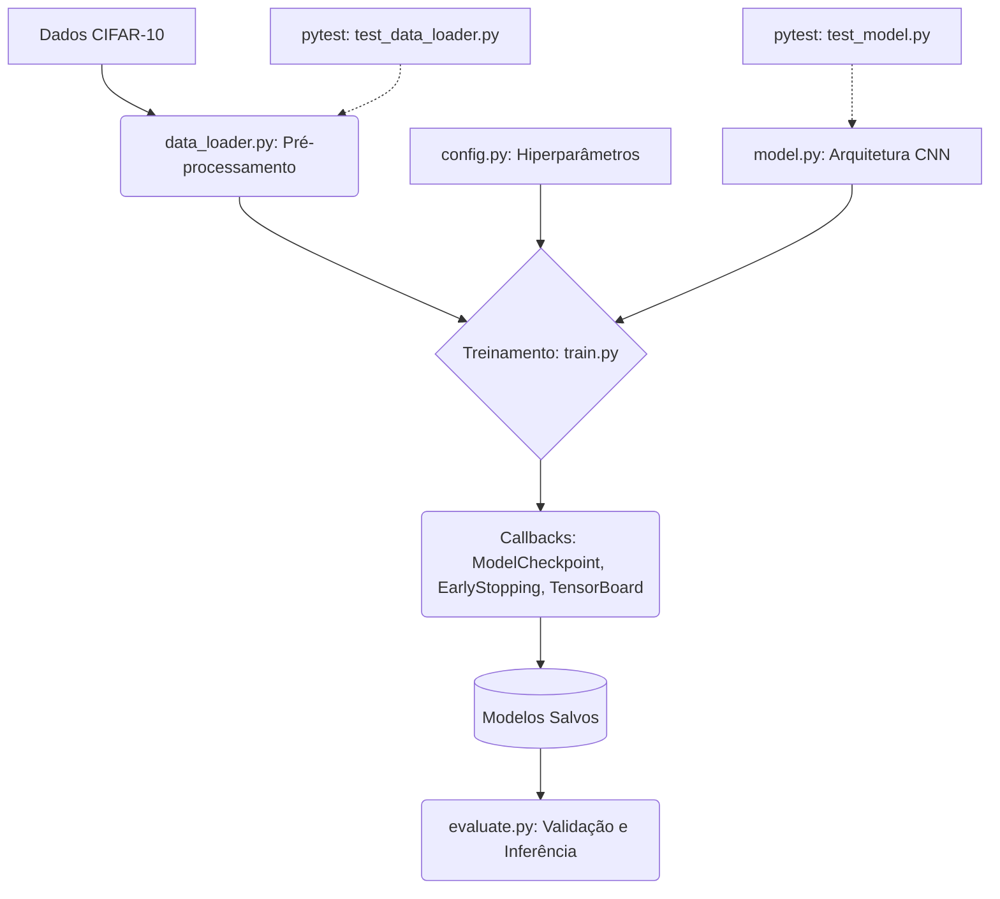

# 🧠 Live CNN: Arquitetura e Pipeline MLOps


## 📌 Visão Executiva

Este repositório foi modernizado a partir de um script monolítico em notebook para uma arquitetura robusta e profissional de Engenharia de Software focada em **Machine Learning Operations (MLOps)**. O projeto treina uma Rede Neural Convolucional (CNN) no dataset CIFAR-10, implementando padrões de projeto como modularidade, callbacks de treinamento (Early Stopping, Checkpointing) e automação de testes unitários.

---

## 🏗️ Arquitetura do Sistema



---

## 🚀 Como Instalar e Executar

**1. Clone o repositório e acesse a pasta:**
```bash
# Navegue até o diretório correspondente
cd live_convolutional_neural_network-CNN-_08072020
```

**2. Crie e ative um ambiente virtual:**
```bash
python -m venv venv
# No Windows:
venv\Scripts\activate
# No Linux/Mac:
source venv/bin/activate
```

**3. Instale as dependências:**
```bash
pip install -r requirements.txt
```

**4. Execute os Testes Unitários (QA):**
Para garantir que a base de código está íntegra antes do treino:
```bash
pytest tests/
```

**5. Inicie o Treinamento do Modelo:**
```bash
python -m src.train
```

**6. Avalie o Modelo Treinado:**
```bash
python -m src.evaluate
```

---

## 💡 Refatorações Aplicadas (Boas Práticas)

- **Extração de Responsabilidades:** O Jupyter Notebook original (`cnn.ipynb`) foi modularizado na pasta `src/`.
- **Prevenção de Overfitting:** Callbacks de `EarlyStopping` impedem que o modelo decaia em performance após o limite ideal.
- **Rastreabilidade (TensorBoard):** Suporte nativo ao monitoramento de métricas e convergência da rede durante as epochs de treinamento.
- **Testes Limites (Boundary Testing):** O conjunto `pytest` cobre o *forward pass* de redes neurais com tensores falsos e valida as normalizações e formato de dados.

---
*Desenvolvido com IA em Pair Programming.*